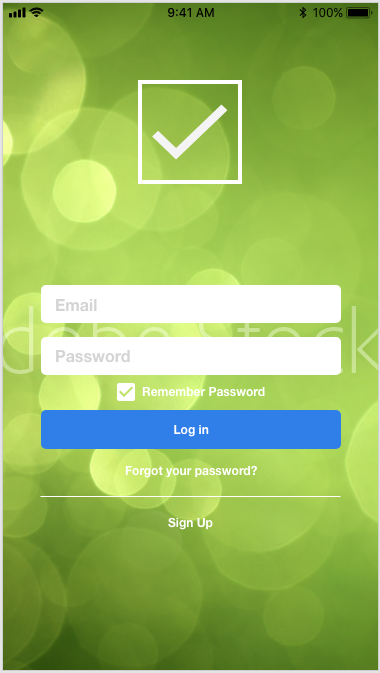

# React Todo Demo

Basic Todo application demo.

## Screenshots



## Technical Details

List of technology used:

* [Node](https://nodejs.org/en/)
* [React](https://reactjs.org/)
* [JavaScript](https://developer.mozilla.org/en-US/docs/Web/JavaScript)
* [Cucumber](https://cucumber.io/)

## Features

* A User can create an account
* A User can login and view their todo lists
* A User can create multiple todo lists
* A User can add todo item to the list
* A User can mark a todo item as complete
* A User can delete a todo item
* A User can modify an existing todo item
* A User can filter the todo list (All | Active | Completed)
* A User can share a list with another user

## Getting Started

1. git clone react todo demo

    ````bash
    git clone https://github.com/corneliuswill/react-todo-demo.git
    ````
    then

    ````bash
    cd react-todo-demo
    ````

2. Install packages

    ````bash
    npm install
    ````

3. Run

    ````bash
    npm run start
    ````

## Running the Tests

   ````bash
   npm test
   `````